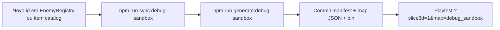

# Debug Sandbox Map (`debug_sandbox`)

Mapa canônico de **playtest** — contém **todos os inimigos** e **todos os itens** do registry, gerados automaticamente.

Relacionado: `docs/debug/sandbox-manifest.json`, `docs/contracts/BENCHMARK_CONTRACT.md` (smoke_test continua para CI de transições)

---

## 1. Para que serve

| Uso | Mapa |
|-----|------|
| Ver todo item no chão + ícone | `debug_sandbox` |
| Ver todo inimigo spawnado | `debug_sandbox` |
| Testar combate / loot / equip UI | `debug_sandbox` |
| CI de escadas / Z-level / casas | `smoke_test` (não mudar) |
| Arena mínima de câmera | `perspective_debug` (legado) |

**Corpo do herói:** perfil fixo (`CHARACTER_VISUAL_SCOPE.md`) — sandbox não altera isso.

---

## 2. Fluxo ao adicionar conteúdo novo



### Checklist

1. **Inimigo** → `src/game/entities/EnemyRegistry.ts`  
2. **Item** → `WeaponRegistry` + `docs/sprites/items/catalog.json` + ícone (`generate:item-icon`)  
3. `npm run sync:debug-sandbox` — atualiza manifest a partir dos registries  
4. `npm run generate:debug-sandbox` — regera `public/maps/debug_sandbox.json` + `_0.bin`  
5. `npm run validate:debug-sandbox` — falha se manifest/map desatualizados  
6. Entrada delta em `docs/MECHANICS_DELTAS.md` se comportamento de spawn mudou  

**Não editar** `entities[]` em `debug_sandbox.json` à mão — será sobrescrito.

---

## 3. Layout (gerado — modo `isolated_chambers` padrão)

```text
┌── parede ─────────────────────────────────────────────┐
│  hub (spawn na spine)     demos (lago, Z) à direita   │
│  ║                                                    │
│  ║══[porta]→[ sala E1 ] [ sala E2 ] [ sala E3 ]       │
│  ║                                                    │
│  ║══[porta]→[ sala E4 ] [ sala E5 ] [ sala E6 ]       │
│  ║                                                    │
│  ║══[porta]→[ sala E7 ] [ sala E8 ] [ sala E9 ]       │
│  ║                                                    │
│              galeria de itens                          │
└────────────────────────────────────────────────────────┘
```

- **1 inimigo por sala fechada** — só entra pela porta (ou arco aberto).
- **`layout.enableDoors: true`** (padrão) — portas bloqueiam até abrir; teste uma criatura por vez.
- **`layout.enableDoors: false`** — mesmas salas, sem porta (útil se a porta 3D atrapalhar).
- Spine vertical à **esquerda**: desce do hub, entra só na sala que quiser.
- Modos alternativos em `manifest.layout.mode`:
  - `isolated_chambers` — **padrão** (recomendado)
  - `open_gallery` — todos soltos nos corredores (stress test)
  - `enemy_rooms` — legado (não usar)

Parâmetros: `docs/debug/sandbox-manifest.json` → `roomWidth`, `roomHeight`, `enableDoors`, etc.
- Símbolos 3 letras (`en00`… inimigos, `it00`… itens) ficam em `manifest.symbols`.

---

## 4. Como entrar no mapa

| Modo | Como |
|------|------|
| **Duplo-clique (Windows)** | `play-debug-sandbox.bat` na raiz do projeto |
| Menu | **DEBUG SANDBOX** (MainMenu) |
| Settings in-game | **Abrir Sandbox Debug** |
| URL | `http://localhost:4000/?map=debug_sandbox&autostart=1` |
| npm | `npm run play:debug-sandbox` |

Spawn: level `0`, **hub na spine oeste** (corredor vertical). Desça e abra **uma porta** por vez para testar combate isolado. Itens na galeria inferior.

**Modos:** `isolated_chambers` (padrão, salas + portas) · `open_gallery` (todos soltos) · `enableDoors: false` (salas sem porta).

**Teste de direção sprite:** uma sala = um inimigo. Matriz N/S/E/W documentada em `docs/sprites/DIRECTION_CONVENTION.md` §2.

**Loadout automático no sandbox:** ao entrar em `debug_sandbox`, o runtime garante um kit mínimo de teste para magia:

- `fire_burst_rune` com pelo menos **10 cargas**
- slot rápido `Q` equipado com `fire_burst_rune` se ainda não estiver em nenhum slot
- pelo menos **5x `magic_rune`** no inventário para testes de altar / grimório

**Portas de teste (quando ativadas no manifest/mapa):**

- `E` perto o suficiente abre/fecha
- clique direito na porta também abre/fecha
- porta fechada bloqueia LOS e pathfinding como parede
- estado é salvo por `uuid`

### Demo vertical (hub)

| Eixo | Level 0 | Level +1 | Level −1 |
|------|---------|----------|----------|
| **Torre (leste do hub)** | `stu` — subir | patamar no tile de chegada; `std` **5 tiles ao sul** | — |
| **Porão (oeste do hub)** | `std` — descer | — | `stu` — voltar |

Torre e porão são **shafts separados** (não ficam no mesmo corredor). Ver `DESIGN_RULES_3D.md` R7.

---

## 5. Arquivos

| Arquivo | Papel |
|---------|--------|
| `docs/debug/sandbox-manifest.json` | Lista de ids + símbolos (sync automático) |
| `scripts/sync-sandbox-manifest.js` | Lê registries → manifest |
| `scripts/generate-debug-sandbox-map.js` | Manifest → JSON + bin |
| `scripts/validate-debug-sandbox.js` | CI / pré-commit |
| `public/maps/debug_sandbox.json` | Metadata BMS |
| `public/maps/debug_sandbox_0.bin` | Tiles chão |

---

## 6. Comandos

```bash
npm run sync:debug-sandbox
npm run generate:debug-sandbox
npm run validate:debug-sandbox
# ou tudo de uma vez:
npm run generate:debug-sandbox
```

(`generate:debug-sandbox` já roda sync antes.)

---

## 7. Inimigos incluídos (auto)

Fonte: `EnemyRegistry.ts` — hoje: rat, skeleton, goblin, goblin_lanceiro, orc, demon, dragon, god, red_wizard.

## 8. Itens incluídos (auto)

Fonte: `docs/sprites/items/catalog.json` + `leather_helmet`.
