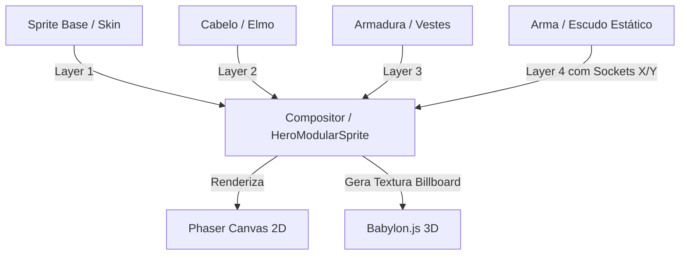

# Guia de Geração de Sprites Modulares, Itens e NPCs (Manual para IA e Desenvolvedores)

Este documento serve como o manual canônico instrucional para que **Desenvolvedores** e **IAs** possam gerar e integrar novos itens de equipamento, aparências (cabelos/elmos) e NPCs de forma 100% compatível com a engine e perspectiva 2.5D do jogo.

---

## 1. Princípios da Perspectiva do Jogo
*   **Perspectiva:** *Low Top-Down* (vista superior com inclinação baixa, aproximadamente 45° a 60°).
*   **Grid e Escala:** O mundo é baseado em blocos de $32\times32$ pixels.
*   **Tamanho do Sprite Canvas:**
    *   Itens individuais (armas/escudos): $32\times32$ pixels.
    *   Spritesheets de Personagens/NPCs: Quadrados de $64\times64$ pixels por frame (alinhados em grades).
*   **Regra de Fundo Transparente:** Todo e qualquer asset gerado deve obrigatoriamente possuir fundo transparente (`no_background: true` na API PixelLab).

### 1.1 Convenção de direções (obrigatório)

**Doc canônico:** `docs/sprites/DIRECTION_CONVENTION.md`

Resumo:

*   `south` = frente para câmera; `north` = costas; `east` = perfil olhando **direita** no PNG; `west` = perfil olhando **esquerda**.
*   Referência visual: `hero_base/character_rotations/` — **sempre** comparar novos NPCs/inimigos antes de integrar.
*   3D: map `y` → world `Z`; `+Z` = `south` na tela. Ver `resolveWorldBmsDirection`.
*   Se east/west estiverem invertidos nos arquivos, corrigir assets primeiro; swap runtime (`GENERATED_SWAP_EAST_WEST_ASSET_DIRS`) só como exceção documentada no spec.

---

## 2. Manual da IA: Como Gerar Itens Compatíveis

Para gerar itens (armas, escudos, cabelos, elmos) que se encaixem perfeitamente nos Sockets do herói modular, siga os prompts e especificações de ângulos abaixo:

### 2.1 Armas de 1 Mão (Espadas, Clavas, Machados)
Para que as armas possam ser rotacionadas e posicionadas via código (sistemas de Sockets) na mão do personagem, elas precisam ser desenhadas em um ângulo estático neutro.

*   **Ângulo Padrão:** Apontando para o **canto superior direito (diagonal de 45°)**, com o cabo/punho posicionado próximo ao **canto inferior esquerdo** da imagem $32\times32$.
*   **Prompt Recomendado para IA:**
    ```text
    pixel art [TIPO_DE_ARMA], icon, transparent background, [MATERIAL] texture, low top-down perspective, oriented 45 degrees pointing top-right, clean dark outline, vibrant colors, Kurzgesagt-inspired simple shading, 32x32 size
    ```
    *(Substitua `[TIPO_DE_ARMA]` por "iron sword", "wooden club" ou "steel axe", e `[MATERIAL]` por "metal", "wood", etc.)*

### 2.2 Escudos (Shields)
Os escudos são renderizados na mão esquerda e precisam exibir a parte frontal (face decorada) voltada ligeiramente para o jogador.

*   **Ângulo Padrão:** Vista frontal levemente inclinada (low top-down), sem rotação diagonal acentuada.
*   **Prompt Recomendado para IA:**
    ```text
    pixel art round shield item, icon, transparent background, flat design, front face visible, low top-down perspective angle, clean dark outline, vibrant colors, 32x32 size
    ```

### 2.3 Cabelos (Hair Styles) e Elmos (Helmets)
Cabelos e elmos são **camadas estáticas de 4 direções** derivadas do `hero_base`, não personagens novos.

*   **Pipeline canônico:**
    1. Partir do `hero_base` calvo (mesmo `character_id` persistido).
    2. `POST /v2/create-character-state` com `edit_description` do cabelo/elmo.
    3. Extrair camada via **pixel diff** (`variant − base`) com `npm run generate:hair-layer`.
    4. Runtime empilha overlay por direção sobre a animação do corpo.
*   **Ângulos Exigidos:**
    *   **Sul (Down):** Vista de frente, mostrando franja e topo da cabeça.
    *   **Norte (Up):** Vista de trás, nuca e topo.
    *   **Leste (East) & Oeste (West):** Vistas laterais de perfil.
*   **Prompt de edição (create-character-state):**
    ```text
    classic short brown hair on bald head, natural hairline, same body proportions unchanged, low top-down view, clean dark outline
    ```

### 2.3.1 Extração de Camada (Pixel Diff)
Não gere cabelo como personagem isolado (`create-character-with-4-directions`) nem use chroma key manual.

*   **Por que funciona:** `create-character-state` mantém alinhamento com o `hero_base`. O script `generate-hair-layer.js` subtrai o calvo do variant e preserva só pixels novos ou alterados (cabelo/elmo).
*   **Comando:**
    ```bash
    npm run generate:hair-layer -- --spec docs/sprites/hero/hair-classic.spec.json
    ```
*   **Spec:** `docs/sprites/hero/hair-classic.spec.json` (campo `production_prompts.edit_description`).
*   **Canvas real:** 92×92 px (documentado em `hero-base.spec.json`), mesmo anchor do corpo base.

### 2.4 Armaduras, Túnicas e Calças (Clothing Layers)
Esses itens **não podem ser imagens estáticas**. Eles devem ser gerados como folhas de animação que imitam perfeitamente a movimentação do corpo base.

*   **Regra de Ouro:** Use o mesmo `character_id` do corpo base e execute o modo `template` da PixelLab (ex: `walking-4-frames`) usando apenas a roupa (o corpo base é configurado como invisível ou substituído pela textura da armadura).

---

## 3. Manual da IA: Como Gerar Inimigos (NPCs não-modulares)

Para monstros e inimigos do debug sandbox / mundo, geramos o spritesheet completo com `generate-pixellab-sprite.js`.

### 3.0 Regra obrigatória — inimigos **sem arma**

**Todos os inimigos gerados via PixelLab devem ser desarmados** (`empty hands`, `no weapons` no prompt).

| Motivo | Detalhe |
| :--- | :--- |
| Consistência | Templates `walking-4-frames` / `breathing-idle` / `lead-jab` **não preservam** espada/lança entre direções e frames |
| Ataque | `lead-jab` = soco/mordida; combate fica coerente sem prop na mão |
| Referência de direção | `hero_base` apenas — **não** usar `goblin_lanceiro` (legado com lança inconsistente) |

**Prompt base (padrão):**

```text
low top-down angle pixel art [CREATURE], humanoid biped empty hands no weapons, neutral standing pose facing camera, same scale as RPG hero sprite, vibrant flat colors, clean dark outline, readable silhouette, transparent background, 64x64
```

**Negative prompt (sempre incluir):** `sword, weapon, shield, spear, axe, dagger, staff, bow, unarmed`

**Quadrúpedes:** use `body_type: "quadruped"` e `pipeline.template_id` (`cat`/`dog`/`bear`/`horse`/`lion`). O script envia `template_id` à API e usa animações quadrúpede (`walk-4-frames`, `idle`, attack/death v3).

**Exceção legada:** `goblin_lanceiro` (com lança) permanece até regeneração futura — **não** copiar esse padrão para novos inimigos.

### 3.1 Template de spec JSON (inimigo)

```json
{
  "id": "skeleton",
  "category": "enemy",
  "production_prompts": {
    "base_generation_prompt": "low top-down angle pixel art undead skeleton warrior, bone white skull and ribcage, dark purple joints, humanoid biped empty hands no weapons, neutral standing pose facing camera, same scale as RPG hero sprite, vibrant flat colors, clean dark outline, readable silhouette, transparent background, 64x64",
    "negative_prompt": "blurry, noisy, sword, weapon, shield, spear, axe, dagger, staff, bow",
    "view": "low top-down",
    "direction": "south",
    "animation_description": "unarmed skeleton warrior"
  },
  "sprite_sheet": {
    "source_canvas": {
      "width": 64,
      "height": 64
    },
    "directions": {
      "death_shared_direction": "south"
    }
  },
  "animation_profile": {
    "tier": "trash",
    "frame_targets": {
      "idle": 4,
      "walk": 6,
      "attack": 6,
      "death": 6
    }
  }
}
```

### 3.2 Executando a geração

1. Salve em `docs/sprites/enemies/{id}.spec.json`.
2. Execute:
   ```bash
   npm run generate:pixellab-sprite -- --spec docs/sprites/enemies/{id}.spec.json
   ```

### 3.3 Integração 3D (runtime)

Após gerar os PNGs em `public/assets/sprites/generated/{entityId}/`:

1. **Validar direções** — `docs/sprites/DIRECTION_CONVENTION.md` §2 (comparar com `hero_base`).
2. Registrar `direction_validation` no `.spec.json` (`status`: `ok` ou `runtime_swap_east_west` + motivo).
3. Registrar runtime — checklist em `docs/three-d/ENEMY_SPRITE_RUNTIME.md`.

- **Referência:** `skeleton` (desarmado, direções vs `hero_base`).
- **Legado:** `goblin_lanceiro` (com lança; não usar como modelo para novos inimigos).
- **Teste:** DEBUG SANDBOX, uma sala por inimigo.

Checklist mínimo: `GENERATED_SPRITE_ENTITIES`, `GENERATED_ANIM_DEFS`, alias se necessário, validação de direção, sandbox.

---

## 4. Estrutura de Integração Técnica (O que a Engine faz)



Runtime 2D: `HeroModularGraphic` (`src/game/graphics/HeroModularGraphic.ts`) — opcional; produto usa 3D.

Runtime 3D (principal): `createHeroModularSpriteMaterial` em `src/three-d/runtime/TwoDParitySpriteFactory.ts` compõe `hero_base` + cabelo no billboard do jogador. Controlado por `PlayerState.equippedHairId` (default: `hair_classic`).

### 4.2 Runtime 3D — Herói modular (canônico)

**Arquivos:**

| Arquivo | Papel |
| :--- | :--- |
| `src/three-d/runtime/TwoDParitySpriteFactory.ts` | Composição body + hair, animação, anchor de pés, footstep ticks |
| `src/three-d/runtime/createDebugSliceScene.ts` | Billboard, sombra, input walk/idle, câmera top-down |
| `public/assets/sprites/generated/hero_base/` | Body animado (idle/walk/attack/death × 4 dirs) |
| `public/assets/sprites/generated/hair_classic/` | Overlay estático 4 direções + `_state/` da API |

**Billboard e grounding (`HERO_BILLBOARD_LAYOUT`):**

- Canvas real do `hero_base`: **92×92** px; linha dos pés medida em **y = 77**.
- Plano billboard: largura **1.0**, altura **1.55** unidades mundo.
- `anchorY` (~**0.52**): posição local Y do plano filho do player para alinhar pés ao chão/sombra — **não** usar offset fixo empírico (ex.: 0.66).

**Cabelo sobre animação (head tracking):**

- O cabelo é overlay **estático por direção** (`character_rotations/{dir}.png`), gerado alinhado ao **idle frame 0** da mesma direção.
- Em runtime, cada frame do body calcula um **head anchor** (centroide da região superior ~34% do bbox do sprite).
- O overlay é deslocado por `(bodyAnchor − idleRefAnchor)` para acompanhar respiração idle e bob walk.
- Limitação conhecida: diferenças extremas de pose (ex.: death) podem exigir camadas animadas por frame no futuro.

**Animação e passos:**

- Estados expostos: `_setAnimState`, `_setDirection`; FPS por estado em `HERO_FRAME_INTERVAL_MS` (idle 6, walk 10, attack 14, death 12).
- Ordem no loop: **atualizar animação antes do movimento físico** (evita áudio adiantado).
- Passos: `_consumeFootstepTick()` — frames walk **0 e 2** + passo inicial ao entrar em walk; `AudioManager.playFootstep(..., force=true)` ignora throttle de 380 ms nesses ticks.

**Câmera top-down (produto):**

- Modo principal: `ArcRotateCamera` com herói **travado no centro da tela** (target = posição do player a cada frame).
- Padrão profissional para RPG aéreo/isométrico (Diablo, PoE): mundo scrolla, personagem não “foge” da câmera.
- **Não** usar `Lerp` lento no follow — gera lag perceptível em velocidade 4.5 u/s.
- First-person (`V`): debug interno; esconde billboard e usa `UniversalCamera` na posição do player.

**Comandos úteis:**

```bash
npm run generate:hair-layer -- --spec docs/sprites/hero/hair-classic.spec.json
npm run generate:hair-layer -- --extract-only   # re-diff sem API
npm run web
```

### 4.3 Equipamentos no corpo (3D)

Elmo, armadura, calça, botas, escudo, armas (1H, 2H) e arco no billboard 3D:

- **Ícone primeiro (menu/chão):** `docs/sprites/items/ITEM_VISUAL_PIPELINE.md`
- **Doc canônico corpo:** `docs/three-d/HERO_BODY_EQUIPMENT.md`
- **Template de spec corpo:** `docs/sprites/hero/equipment/equipment-layer.spec.template.json`
- **Piloto:** `leather_helmet` — specs em `docs/sprites/items/` e `docs/sprites/hero/equipment/`

Estado atual: apenas **body + cabelo** renderizam no 3D; ícones dependem de `public/assets/items/{id}.png` (gerar com `npm run generate:item-icon`).

### 4.1 Lógica do Posicionamento de Sockets de Armas
No arquivo de configuração de animação do herói, definimos os pontos de encaixe relativos para a mão que segura a arma:

```typescript
const WEAPON_SOCKETS = {
  walk: {
    south: [
      { x: 10, y: 18 }, // frame 0
      { x: 10, y: 19 }, // frame 1
      { x: 9,  y: 18 }, // frame 2
      { x: 10, y: 18 }, // frame 3
      { x: 11, y: 19 }, // frame 4
      { x: 10, y: 18 }  // frame 5
    ],
    // ... outras direções
  }
};
```
O código então posiciona a imagem da arma de 1 mão (gerada a 45° conforme o item 2.1) no ponto da mão e aplica rotações extras se o estado for de ataque.
