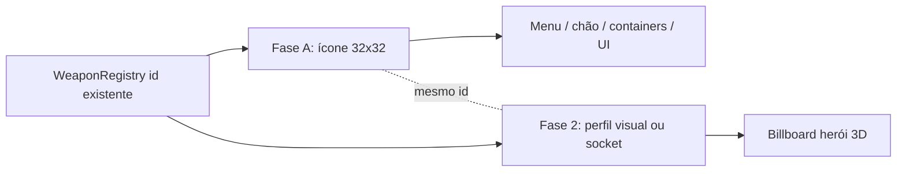

# Pipeline Visual de Itens — Ícone (Fase A) + Corpo (Fase B)

Manual canônico para equipamentos e armas que **já existem** em `WeaponRegistry` / inventário.  
**Nunca** criar um item novo só por causa da arte — o `id` do registry é a chave de tudo.

Relacionado:

- **`docs/CHARACTER_VISUAL_SCOPE.md`** — escopo alpha (corpo fixo + perfis visuais; **não** overlay modular de elmo/armadura)
- `docs/three-d/HERO_BODY_EQUIPMENT.md` — alvo pós-alpha (perfis de pose, sockets)
- `docs/sprites/MODULAR_SPRITE_AND_NPC_GENERATION_GUIDE.md` — perspectiva e prompts
- `docs/contracts/SPRITE_PIPELINE_CONTRACT.md`

---

## 1. Princípio (sempre nesta ordem)



| Fase | O quê | Onde aparece | Asset |
| :--- | :--- | :--- | :--- |
| **A — Ícone** | Sprite cartoon legível 32×32 | Inventário, painel de equip, chão 3D, containers | `public/assets/items/{registry_id}.png` |
| **Alpha — Corpo** | Perfil fixo `hero_default` | Herói no mundo | `hero_base` + cabelo (ver `CHARACTER_VISUAL_SCOPE.md`) |
| **Fase 2 — Corpo** | Perfil de pose ou socket 1H | Herói equipado | `public/assets/sprites/generated/{profile_id}/` |

**Regra de ouro:** `registry_id` === `WeaponRegistry[].id` === nome do PNG do ícone === pasta de camada (salvo exceção documentada em `visual_entity_id`).

Exemplo piloto: **`leather_helmet`** — stats em `WeaponRegistry`, ícone em Fase A, elmo no corpo em Fase B.

---

## 2. Estilo do ícone (Fase A)

Alvo: **cartoon legível**, coerente com o jogo (flat, contorno escuro, cores vibrantes).

| Campo | Valor |
| :--- | :--- |
| Canvas | **32×32** px |
| Perspectiva | *Low top-down* (~45°–60°) |
| Fundo | Transparente obrigatório |
| Silhueta | Forte; detalhe mínimo que some no slot 48×48 UI |
| Referência de tom | “Kurzgesagt-inspired” flat colors (ver contrato de sprites) |

**Não** reutilizar o ícone 32×32 diretamente no corpo — escala e anchor são diferentes.

### Onde o engine carrega o ícone

Toda UI já aponta para o mesmo caminho:

```text
assets/items/{itemId}.png
```

Arquivos físicos: `public/assets/items/{itemId}.png`

Usado em: `HeroEquipmentPanel`, `HeroSmartInventory`, `RPGSlot`, `EquipmentWidget`, `HeroInventory`.

### Chão / drops 3D

Runtime 3D deve usar o **mesmo PNG** como billboard no chão quando existir (fallback: esfera debug).

Exemplo piloto: **`leather_helmet`** — stats em `WeaponRegistry`, ícone em Fase A; **corpo alpha não muda** (elmo só stats + ícone).

---

## 3. Corpo no mundo (alpha vs fase 2)

**Alpha (implementado):** `resolveCharacterVisualProfile(PlayerState)` → sempre `hero_default` (`hero_base` + cabelo). Equipar elmo/armadura **não** altera o sprite — ver `docs/CHARACTER_VISUAL_SCOPE.md`.

**Fase 2 (quando assets existirem):**

| Tipo | Pipeline |
| :--- | :--- |
| Cabelo | pixel diff em `hero_default` (`generate:hair-layer`) |
| Arma 1H | socket com ícone 32×32 sobre `hero_default` |
| 2H / arco / 1H+escudo | perfil visual dedicado (`create-character-state` + animate) |

**Deprecated (não usar):** pixel diff de elmo/armadura; `generate:head-overlay`; 4× pixflux por direção.

Ao **equipar**, `PlayerState` continua emitindo stats/slots; o compositor 3D usa **perfil visual**, não overlay por `registry_id`.

---

## 4. Specs por item (dois arquivos)

Cada equipamento com arte completa tem **dois specs**:

| Arquivo | Fase |
| :--- | :--- |
| `docs/sprites/items/{nome}.spec.json` | A — ícone |
| `docs/sprites/hero/equipment/{nome}.spec.json` | B — corpo |

Template ícone: `docs/sprites/items/item-icon.spec.template.json`  
Template corpo: `docs/sprites/hero/equipment/equipment-layer.spec.template.json`

Campos obrigatórios em ambos:

```json
{
  "registry_id": "leather_helmet",
  "links": {
    "weapon_registry": "src/game/entities/weapons/WeaponRegistry.ts",
    "item_icon_spec": "docs/sprites/items/leather-helmet.spec.json",
    "body_layer_spec": "docs/sprites/hero/equipment/leather-helmet.spec.json"
  }
}
```

---

## 5. Exemplo: ícone de equipamento

Qualquer item do registry segue o mesmo fluxo — **só ícone no alpha**, corpo fixo.

```bash
npm run generate:item-icon -- --spec docs/sprites/items/leather-helmet.spec.json
# → public/assets/items/leather_helmet.png
```

Equipar no jogo: stats + slot + ícone. **Zero alteração no billboard do herói.**

Specs de corpo em `docs/sprites/hero/equipment/` e pastas `equipment/` / `generated/leather_helmet/` são **tentativas arquivadas** — não rodar de novo sem task explícita de fase 2.

---

## 6. Comandos

```bash
# Ícone 32x32 (menu, chão, containers)
npm run generate:item-icon -- --spec docs/sprites/items/{id}.spec.json

# Cabelo (só hero_default)
npm run generate:hair-layer -- --spec docs/sprites/hero/hair-classic.spec.json
```

**Deprecated:** `generate:head-overlay`, specs de elmo/equipamento para corpo.

Requer `PIXELLAB_API_KEY` no `.env`.

---

## 7. Checklist — novo item visual (alpha)

1. Confirmar que **`id` já existe** no registry de gameplay.
2. Criar `docs/sprites/items/{id}.spec.json`.
3. Rodar `generate:item-icon`; commitar `public/assets/items/{id}.png`.
4. Validar: slot de equip + chão 3D mostram o ícone.
5. **Não** gerar camada de corpo até fase 2 (`CHARACTER_VISUAL_SCOPE.md`).
6. `npm run sync:debug-sandbox && npm run generate:debug-sandbox` — item aparece no mapa de playtest.

---

## 8. Estado atual (alpha)

| Escopo | Status |
| :--- | :--- |
| Ícones (`assets/items/`) | Por item — gerar sob demanda |
| Corpo 3D | `hero_default` fixo — equipamento não altera |
| Cabelo | `hair_classic` overlay (pixel diff) |

Fallback sem PNG de ícone: UI quebra imagem; chão 3D usa esfera debug.
