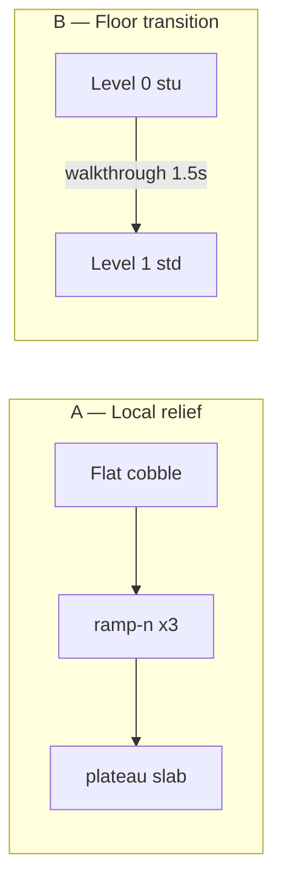

# Elevation, Ramps & Stairs — 3D World Plan

> Goal: the world should not feel flat. Forests have mounds, cities have grades, dungeons have steps, and **level changes** (Z floors) use ramps or stair meshes.

## Current state (2026-06)

| Capability | Status |
|------------|--------|
| **Stair mesh** (`geometryProfile: "stair"`, `stu`/`std`) | ✅ Geometry worker + 1.5s walkthrough anim + level switch |
| **Ramp mesh** (`ramp-n/s/e/w`) | ✅ Geometry exists; **no maps used it until sandbox demo** |
| **Ground height sampling** | ✅ `GroundHeightQuery3D.ts` — player/enemies follow ramp/stair/slab Y |
| **Within-level hills** | 🟡 `slab` + `height` / `hlm` mound tile — manual per tile |
| **Procedural biome relief** | ❌ Not started |
| **Ramp as level transition** | ❌ Planned (reuse stair flow with `rampRise: 2.0`) |

---

## Two elevation concepts (do not mix without naming)

### A) **Local relief** (same map level, same `level` key)

Small Y changes (0.15–0.5 units) for morros, calçada inclinada, forest floor.

- **Tile tools:** `geometryProfile: "slab"` + `height`, or `ramp-*` + `rampRise`
- **Gameplay:** walk normally; Y sampled from mesh
- **Biomes:** generator places `hlm`, `rpn` chains, low `rampRise`

### B) **Floor transition** (Z-level change, `level` 0 → 1)

Full rise = `LEVEL_HEIGHT_UNITS` (2.0) matching stacked floors.

- **Stairs:** `stu` / `std` + `stairDir` (existing)
- **Ramps:** `ramp-*` with `rampRise: 2.0` + transition trigger at high edge (TODO)
- **Holes:** `hol` void fall (existing)



---

## Tile atlas extension (canonical symbols)

Add to `WORLD_MAP_CONTRACT.md` when biomes adopt:

| Sym | ID | geometryProfile | rampRise / height | Use |
|-----|-----|-----------------|-------------------|-----|
| `rpn` | ramp-n | ramp-n | 0.2–0.4 local; 2.0 floor | Sobe ao andar south |
| `rps` | ramp-s | ramp-s | same | Sobe ao andar north |
| `rpe` | ramp-e | ramp-e | same | East |
| `rpw` | ramp-w | ramp-w | same | West |
| `hlm` | hill-mound | slab | height 0.15–0.35 | Morro / calçada |
| `stu` | stairs-up | stair | — | Level +1 (existing) |
| `std` | stairs-down | stair | — | Level -1 (existing) |

**Direction rule (ramp-n):** north edge low, south edge high — walk **south** to climb.

---

## Runtime architecture

```
tileDefinitions → GroundHeightQuery3D.sampleGroundFootY(x,z,level)
                         ↓
              player.position.y / enemy.worldPos.y
                         ↓
              + aquatic sink (water overlay)
```

Files:

| File | Role |
|------|------|
| `TileSurfaceResolver.ts` | **Canonical** surface + foot Y for all tile kinds |
| `SliceTileTypes.ts` | Shared tile schema (`rampRise`, `geometryProfile`) |
| `GroundHeightQuery3D.ts` | Back-compat wrapper around resolver |
| `geometry.worker.ts` | Mesh generation (already has ramp/stair) |
| `createDebugSliceScene.ts` | Movement, stair anim, void fall |

---

## Execution phases

### Phase 1 — Ground follow ✅ (done)

- [x] `GroundHeightQuery3D`
- [x] Player + enemy Y from sampled ground
- [x] Sandbox: west ramp strip + plateau + mound

**Test:** `?slice3d=1&map=debug_sandbox` — walk west across green ramps; character should climb smoothly.

### Phase 2 — Ramp level transitions (in progress)

1. `levelTransition: "up"|"down"` on full-height ramps (`rampRise: 2.0`) ✅
2. **Automatic** at top/bottom edge while walking ✅ (`VerticalTransition3D.ts`)
3. Ledge fall — drop > 0.42u uses gravity instead of snap ✅
4. Stair `activeLevel` sync fix ✅ (`applyActiveLevelChange`)
5. Pair ramp on level N with floor on level N+1 ✅ (sandbox `rfu`)

**Test:** `?slice3d=1&map=debug_sandbox`
- Gold ramp east of tower stairs (`rfu`) — walk **south** to climb to +1
- Tower balcony south — step into void to fall to level 0

### Phase 3 — Biome generators

**Forest (`grs` + `hlm` + noise):**

- Simplex noise threshold → place mound tiles
- Clear paths stay flat (`pat`)
- Trees on mounds allowed (collision unchanged)

**City (`cob` + `pav`):**

- Avenue grade: 1–2 ramp tiles between districts (+0.25 rise)
- “Mal planejada” districts: occasional `hlm` near walls
- Plaza stays `slab` flat

**Dungeon:**

- Mostly flat; stairs at room exits (existing `stu`/`std`)

Generator hooks: `scripts/generate-*-map.js` — add `applyReliefPass(buffer, noiseSeed, biomeRules)`.

### Phase 4 — Navigation & collision polish

- Pathfinding cost + on ramps (optional slow)
- `isWorldPositionBlocked` sample 4 corners at correct Y
- Enemy AI: preserve Y when pathing on slopes
- Minimap: height tint (optional)

### Phase 5 — 2D parity (deferred)

2D Phaser stays flat unless a separate `height` contract is added to BMS. **3D is source of truth for relief.**

---

## Layout examples

### Forest clearing with mound

```
grs grs grs grs
grs hlm hlm grs
grs hlm tre grs
grs grs pat pat
```

### City grade between blocks

```
cob cob cob rpn rpn rps rps
cob bwl bwl bwl bwl bwl bwl
```

### Floor ramp (future — full 2.0 rise)

Level 0:

```
flr flr rpn rpn rpn
flr flr flr flr flr   ← exit corridor south
```

Level 1 (same XZ, high end opens to floor):

```
flr flr flr flr flr
flr flr rps rps rps   ← arrival from below
```

---

## Open decisions (defaults suggested)

| Question | Suggested default |
|----------|-------------------|
| Ramp level transition: click or automatic? | **Automatic** at top edge (like walking through stair) |
| Max local `rampRise` without handrail? | **0.5** units |
| Forest mound density | **8–12%** of grass tiles in wild zones |
| City grade | **0%** in plaza, **5%** in residential grids |

---

## Debug sandbox zones (current)

| Hub zone | Direction | Feature |
|----------|-----------|---------|
| East | → | Water lake (`wat`/`wtr`) |
| West | ← | Ramp chain + plateau + mound |
| Center | | Spawn |

Regenerate: `npm run generate:debug-sandbox`
