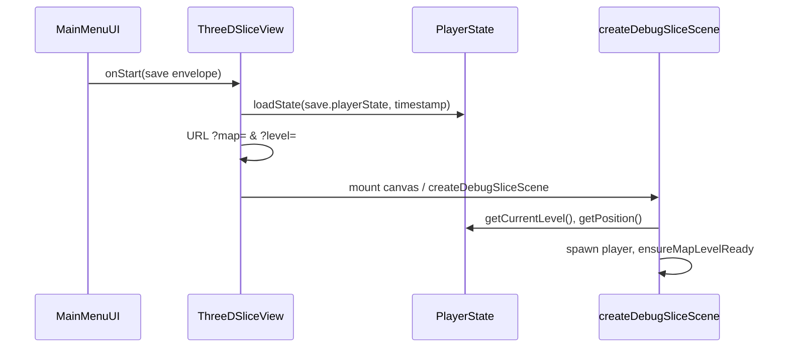

# 3D Save / Load

Canonical reference for persistence in the Babylon slice runtime.  
**Code:** `SaveSystem.saveGameDirect`, `PlayerState.exportSnapshot` / `loadState`, `ThreeDSliceView.handleThreeDStart`  
**Types:** `src/game/types/PlayerSnapshot.ts`, `SaveSystem.GameSaveData`  
**Contract (shared):** [../contracts/SAVE_SYSTEM_CONTRACT.md](../contracts/SAVE_SYSTEM_CONTRACT.md)

Related: [SLICE_RUNTIME.md §19](./SLICE_RUNTIME.md#19-save--load), [COMPATIBILITY_AUDIT.md](./COMPATIBILITY_AUDIT.md) rows 3D-17, 3D-27

---

## 1. Product path today

| Mode | Storage | Durable? |
| :--- | :--- | :--- |
| **Electron** | `window.electronAPI.saveGame(name, data)` | ✅ Yes |
| **Browser dev** | `SaveSystem.memorySaveData` in RAM | ❌ Session only |

3D does **not** use `GameScene` or `SaveSystem.saveGame()`. It uses **`saveGameDirect()`** on the Phaser-free `src/core/systems/SaveSystem.ts`. The core constructor takes no arguments.

---

## 2. Save envelope (`GameSaveData`)

Built in `SaveSystem.saveGameDirect`:

| Field | Source in 3D | Notes |
| :--- | :--- | :--- |
| `map` | `sliceMapName` from URL (`?map=`) | e.g. `city_3d_mundi_p1`, `debug_sandbox` |
| `currentLevel` | `activeLevel` in slice | BMS level id string (`"0"`, `"-1"`, …) |
| `playerPos` | `{ x, y }` pixel coords | `world × 32`, rounded to 2 decimals |
| `playerState` | `PlayerState.exportSnapshot()` | Full snapshot — see §3 |
| `deadEnemies` | `[]` (default) | **2D scene field** — not populated by 3D save today |
| `activeEnemies` | `[]` (default) | **2D scene field** — not populated by 3D save today |
| `timestamp` | `Date.now()` | |
| `version` | `SaveSystem.SAVE_VERSION` (core) | **`2.3.0`** — must match `PlayerSnapshot` comment |

### When save runs

| Trigger | Location |
| :--- | :--- |
| Auto-save every **60 s** | `createDebugSliceScene` render loop |
| **F5** | `ThreeDSliceView` → `runtime.save()` |
| System menu Save / Save & Exit | `SystemMenuUI` → `saveAndNotify()` |

---

## 3. Player snapshot (`PlayerSnapshot`)

Authoritative progression lives in **`playerState` inside the envelope**, not in top-level enemy arrays.

### 3D-specific fields (inside `playerState`)

| Field | Runtime API | Purpose |
| :--- | :--- | :--- |
| `deadEnemies3d` | `markEnemy3dDead` / `isEnemy3dDead` | `Record<level, spawnKey[]>` — killed enemies stay dead |
| `persistentItems` | `addPersistentDroppedItem`, pickup | Per-level dropped loot (pixel coords) |
| `exploredAreas` | `exploreArea` | Minimap fog |
| `visitedLevels` | stair transitions | Global set |
| `containers`, `altarStorage` | container UI | Keyed storage |
| `equippedRuneSlots`, `enchantedRunes` | Q/R + grimório | |

Full field list: `src/game/types/PlayerSnapshot.ts`.

### Export / import API

```typescript
const snapshot = playerState.exportSnapshot(); // SaveSystem only
playerState.importSnapshot(snapshot, saveTimestamp); // or loadState(data, timestamp)
```

`loadState` includes legacy migration (old skill keys, buff duration adjustment via `saveTimestamp`).

---

## 4. Load flow (menu → slice)



### Steps

1. **MainMenuUI** loads save via Electron or `localStorage` key `tgs_save_{name}`.
2. **ThreeDSliceView.handleThreeDStart** (load branch):
   - `playerState.loadState(data.playerState, data.timestamp)`
   - Sets URL `?map=` and optional `?level=` from envelope
3. **createDebugSliceScene** starts:
   - Map from `?map=` (fallback `debug_sandbox`)
   - `activeLevel = playerState.getCurrentLevel()`
   - Player world position from `playerState.getPosition()` (pixel → world `/32`)
   - Invalid spawn → nearest walkable search in `ensureMapLevelReady`

---

## 5. Coordinate rules

| Space | Save field | Slice usage |
| :--- | :--- | :--- |
| Pixel X/Y | `playerPos.x`, `playerPos.y` | BMS horizontal plane; **Y in save = world Z** |
| World | — | `player.position.x = px/32`, `player.position.z = py/32` |
| Level | `currentLevel` + snapshot state | `activeLevel`, `levelToWorldY(level)` |

Every frame the slice calls `recordPlayerPosition(activeLevel, x×32, z×32)` so in-session position stays in `PlayerState`.

---

## 6. Enemy persistence (3D)

| Mechanism | Storage | Restore |
| :--- | :--- | :--- |
| Killed enemies | `playerState.deadEnemies3d` → snapshot | `spawnEnemy` skips if `isEnemy3dDead(level, spawnKey)` |
| Live HP / position | Not saved | Enemies respawn from map on re-entry except dead keys |

**Spawn key:** deterministic `${level}_${enemyType}_${index}` at seed time.

2D fields `deadEnemies` / `activeEnemies` on the envelope are **legacy**; 3D kill state is **`deadEnemies3d` in snapshot only**.

---

## 7. Known gaps (factual — code today)

| ID | Issue | Impact |
| :--- | :--- | :--- |
| **SL-01** | Load path may not apply envelope `playerPos` / `currentLevel` before slice init | `ThreeDSliceView` sets URL `?level=` but slice **does not read** URL level; relies on `PlayerState.getCurrentLevel()` / `getPosition()` which may still be defaults if not restored from envelope |
| **SL-02** | `saveGameDirect` never passes `deadEnemies` / `activeEnemies` | Harmless for 3D; 2D-only fields empty |
| **SL-03** | Browser mode non-persistent | Expected — see contract §2 |
| **SL-04** | `GameSaveData` TypeScript type omits `deadEnemies3d` on nested `playerState` | Type drift; runtime includes it via `exportSnapshot` |

Fixing SL-01 is implementation work (e.g. `recordPlayerPosition` + `setCurrentLevel` from envelope in `handleThreeDStart`).

---

## 8. Quick reference

```
save:  saveGameDirect({ map, currentLevel, playerPos }) + exportSnapshot()
load:  MainMenuUI → loadState(playerState) → slice reads PlayerState position/level
kill:  markEnemy3dDead → in snapshot.deadEnemies3d
loot:  persistentItems in snapshot (not scene meshes)
```
